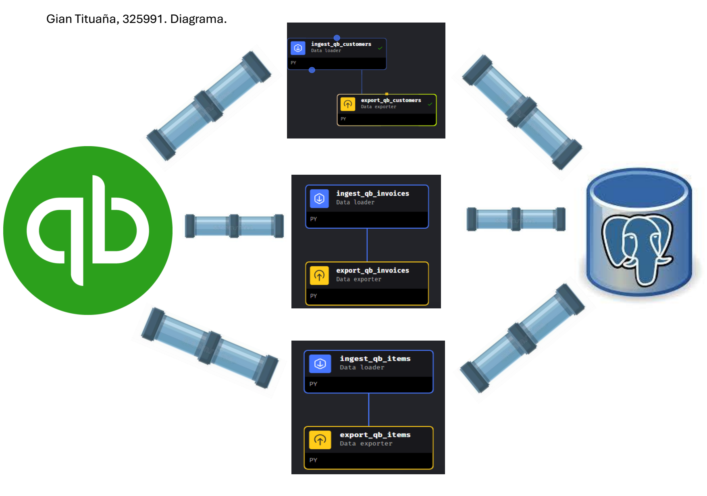
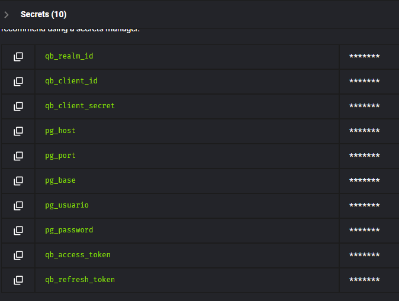

**Descripción del Proyecto y Arquitectura**  🚀 

Este proyecto implementa un pipeline de datos para extraer información contable de la API de QuickBooks y cargarla en una base de datos PostgreSQL. La orquestación se gestiona con Mage.

**Pasos para Levantar Contenedores y Configurar el Proyecto 🛠️**
Clonar el repositorio:

Bash

git clone https://github.com/GianTituana/data_mining_pset1.git
cd tu-repositorio

Iniciar Docker Compose:

Bash

docker-compose up -d

Esto levantará los contenedores de Mage, PostgreSQL y pgAdmin

Acceder a Mage:
Abre tu navegador y navega a http://localhost:6789

Acceder a pgAdmin:
Abre tu navegador y navega a http://localhost:8080

**IMPORTANTE: Si los contenedores de postgres y pgadmin no arrancan despues de hacer docker-compose up -d, borrar las carpetas de warehouse y warehouseui clonadas, y volver a ejecutar el comando (docker-compose up -d)**

**IMPORTANTE: En pgAdmin registrar un nuevo servidor con el nombre de host 'warehouse' (el general también puede ser 'warehouse') y usar el usuario y contraseña del dockercompose. Una vez creado el servidor, crear un esquema 'raw' en la base de datos 'postgres' que está por defecto.**

Claro, aquí tienes un README.md completo que incluye todos los puntos que mencionaste, con una explicación clara y una estructura organizada.

Descripción del Proyecto y Arquitectura 🚀
Este proyecto implementa un pipeline de datos para extraer información financiera de la API de QuickBooks, transformarla y cargarla en una base de datos PostgreSQL. La orquestación se gestiona con Mage. El objetivo es crear un almacén de datos centralizado para análisis y reportes.

Pasos para Levantar Contenedores y Configurar el Proyecto 🛠️
Clonar el repositorio:

Bash

git clone https://github.com/tu-usuario/tu-repositorio.git
cd tu-repositorio
Iniciar Docker Compose:

Bash

docker-compose up -d
Esto levantará los contenedores de Mage y PostgreSQL.

Acceder a Mage:
Abre tu navegador y navega a http://localhost:6789.

**Gestión de Secretos** 🔒
Las credenciales de acceso a la API de QuickBooks y a la base de datos de PostgreSQL se gestionan como secretos para proteger la información sensible.

Propósito: Autenticación con la API y la base de datos.

Responsable: El equipo de Ingeniería de Datos es responsable de su uso y rotación.

**Pipelines qb_<entidad>_backfill** 📊
Se han implementado tres pipelines de tipo backfill para las entidades Customers, Invoices y Items.

Parámetros: Aceptan un rango de fechas (start_date y end_date) para la extracción de datos históricos.

Segmentación: Los datos se procesan en chunks diarios variables (por default 7 días) para evitar sobrecargas de memoria. 

Límites: El límite de la API de QuickBooks es de 100 registros por solicitud. El pipeline maneja automáticamente este límite mediante paginación.

Reintentos: Cada bloque del pipeline está configurado con 5 reintentos automáticos con un backoff exponencial en caso de fallos transitorios.

Runbook:

Crear un trigger one-time en Mage.

Especificar las fechas start_date y end_date en UTC.

Monitorear el run en la interfaz de Mage.

Si falla, revisar los logs.

**Trigger One-time** ⏰
Fechas en UTC: Las fechas del trigger se deben especificar en UTC (+00). Para convertir de la hora de Guayaquil (UTC-5), se deben sumar 5 horas.

Ejemplo: Si desea ejecutar un backfill para el 12 de septiembre de 2025 a las 10:00 AM en Guayaquil.

Política: El trigger se configura para ser deshabilitado automáticamente después de la ejecución exitosa, para evitar ejecuciones accidentales futuras.

**Esquema raw** 📦
El esquema raw es donde se guardan los datos tal como se extraen de la API, sin transformaciones. Es la capa de ingesta de datos. Si ya tienes una base de datos en otra carpeta o servicio, el docker-compose.yml debe apuntar a ese servicio, y tus pipelines de Mage se conectarán a esa base de datos.

raw.customers: Contiene la información de clientes.

raw.invoices: Contiene los datos de facturas.

raw.items: Contiene la información de los productos y servicios.

Claves: La clave primaria de cada tabla es el id de la API de QuickBooks.

Metadatos Obligatorios: Cada tabla debe incluir columnas de metadatos como ingested_at_utc (timestamp de carga), extract_window_start_utc y extract_window_end_utc, page_number/page_size, request_payload.

Idempotencia: Se garantiza la idempotencia utilizando la sentencia UPSERT. Esto asegura que las ejecuciones repetidas no creen registros duplicados.

**Validaciones y Volumetría** ✅
Cómo correrlas: Dentro de cada pipeline, en el último bloque, se ejecuta una consulta de validación de volumetría. Simplemente ejecute el pipeline para que se realicen las validaciones.

Interpretación:

Conteo de Registros: Se compara el conteo de registros extraídos de la API con el conteo de registros cargados en la base de datos para verificar que no haya pérdidas.

final_count > 0: Se verifica que el número de registros cargados sea mayor a cero.

**Troubleshooting** 🩺
Autenticación: Verificar las credenciales en la configuración de Mage.

Paginación: Si se omiten registros, revisar el parámetro limit de la API.

Límites de la API: En caso de errores 429, revisar los límites de la API de QuickBooks para evitar sobrecargarlos.

Timezones: Confirmar que todos los timestamps estén en UTC para evitar errores de interpretación.

Almacenamiento y Permisos: Si la base de datos se queda sin espacio, revisar el volumen de Docker. Asegurarse de que el usuario de la base de datos tenga los permisos correctos (CREATE, INSERT, UPDATE).

**Checklist de aceptación**

Mage y Postgres se comunican por nombre de servicio. ✅

Todos los secretos (QBO y Postgres) están en Mage Secrets; no hay secretos en el repo/entorno expuesto. ✅

Pipelines qb_<entidad>_backfill acepta fecha_inicio y fecha_fin (UTC) y segmenta el rango. ✅

Trigger one-time configurado, ejecutado y luego deshabilitado/marcado como completado. ✅

Esquema raw con tablas por entidad, payload completo y metadatos obligatorios. ✅

Idempotencia verificada: reejecución de un tramo no genera duplicados. ✅

Paginación y rate limits manejados y documentados. ✅

Volumetría y validaciones mínimas registradas y archivadas como evidencia.✅

Runbook de reanudación y reintentos disponible y seguido.✅
